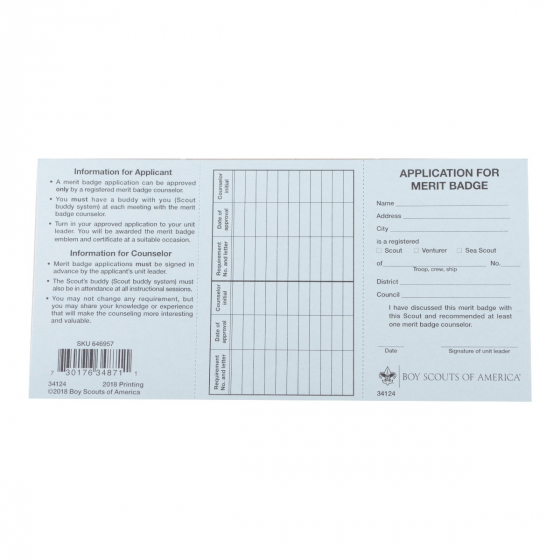

# Blue Card
* **Purpose of the application:**
   A windows desktop application to print BSA marit badge cards.  Written in C# and built with Windows Presentation Foundation framework.

* **How to use:**
   Add instructions...

* **Features of the application:**
   Add features discussion...

## Site Preview

## This application was built by
- [Dan Ochs](https://github.com/DanOchs99)

## Project dependencies:
- Windows Presentation Framework (WPF)

